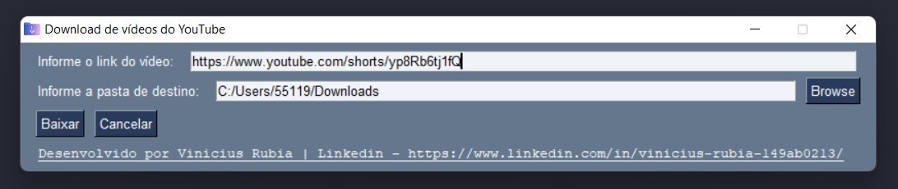
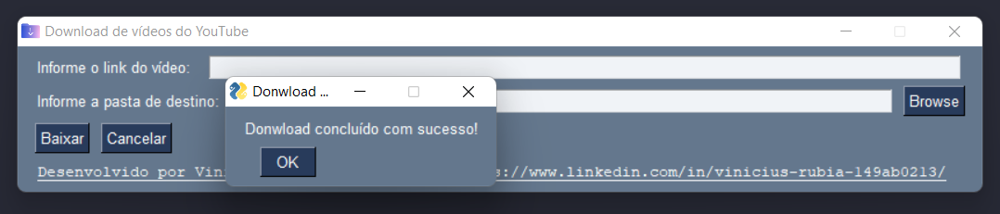

# Download de vídeos do YouTube com Python

|Link e destino do Download|
|---|



|Download Concluído|
|---|
|
---

## 👻 Visão Geral

- Esse software consiste em fazer download dos vídeos do youtube pra seu computador;
- De forma mais rápida do que nos sites que temos hoje pra converter os vídeos; 
- Além de fazer o download você pode escolher o local de destino do vídeo;
- Um vídeo de 15 minutos, com uma internet razoável você baixa em menos de 20 segundos;

## 🚀 Começando

Pra começar, primeiro clone o repositório do projeto pra sua máquina

```
$ git clone https://github.com/Vinicius-Rubia/Download-Videos-Python.git
```
---

## ⚙️ Executando a aplicação

Para iniciar a aplicação você pode executar o arquivo que está em ` app/main.exe ` que já está pronto, ou se preferir alterar algo no código e querer executar você primeiro precisa executar no seu terminal:

```
$ pip install pytube
```
```
$ pip install PySimpleGUI
```
---

## 😎 Como funciona

Depois de executar a aplicação, para fazer o download você precisa:

- Informar no primeiro campo o link do vídeo a ser baixado;
- Infromar no segundo campo o local onde será baixado o vídeo. Também pode usar o botão ` Browse ` pra procurar o local;
- Clicar no botão ` Baixar ` para começar o download;

Quando terminar o Download, aparecerá um popup concluindo.

---
⌨️ com ❤️ por [Vinicius Rubia](https://github.com/Vinicius-Rubia) 😊